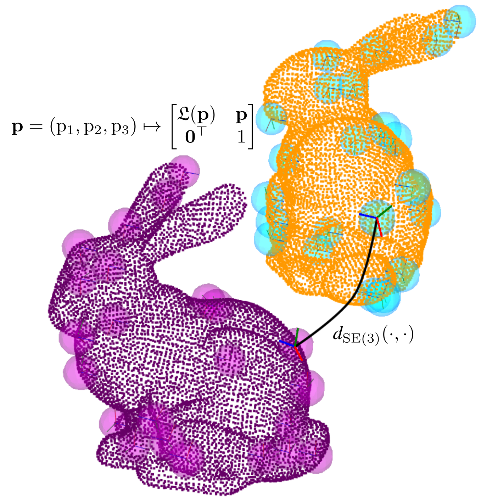

# 🎤 SE(3)-ICP

Official implementation: [A Generalization of Iterative Closest Point Registration Algorithms using a Local Reference Frame based SE(3) Augmentation](https://ieeexplore.ieee.org/stamp/stamp.jsp?tp=&arnumber=11396504) (IEEE Access, 2026) Kenan Ahmic, Michael Stolz, and Daniel Watzenig.

## Introduction

<p align="center">
  
  <br />
  <em> The key idea of the proposed method is to augment 3D points into SE(3) elements, represented as 4x4 homogeneous matrices. The translation part is defined as the original point, and the rotation part is computed using a local reference frame method (we use the TOLDI LRF method).  We then formulate ICP-based algorithms by comparing distances in SE(3) space, depicted as the curved line.  </em>
</p>

SE(3)-ICP is a generalization of popular iterative closest point (ICP) methods, including point-to-point, point-to-plane, and generalized ICP. After augmenting 3D points **p** into sets of 4x4 SE(3) homogeneous matrix, we then perform ICP-based registration by iterating correspondence search and optimization steps until some convergence criteria are met. The optimization step of standard ICP methods remains the same. However, we perform a correspondence search over the augmented clouds. This is done by performing a nearest neighbor search over SE(3) space while effectively balancing rotation and translation components. If the rotation weighting coefficient is zero, we recover standard ICP methods. In fact, we let our method reduce to standard ICP methods in the latter iterations for some extra precision (check out the paper for more details).

**Results**: Substantial increase in the convergence basin compared to standard ICP methods, which require a much more precise initial guess. We obtain the best result among many fine-registration methods over a few benchmarks, while retaining the efficiency and simplicity of ICP.   

## Dependencies

- CMake ≥ 3.10
- C++17 supported compiler
- Point Cloud Library (PCL) (tested on v1.14)
- Eigen3 (≥ 3.3)
- OpenMP
- Open3D (C++ library) (tested on v0.19.0)

## Quick setup (Ubuntu / Debian)

#### Install dependencies
```bash
sudo apt update
sudo apt install -y build-essential cmake git libeigen3-dev libpcl-dev libomp-dev

# Install/build Open3D separately following its docs:
# https://www.open3d.org/docs/release/compilation.html
```

#### Clone & build
```bash
git clone https://github.com/kenahm/se3-icp.git
cd se3-icp
mkdir build && cd build
cmake ..
make -j$(nproc) # or if cmake constructed ninja files: ninja -j$(nproc)
```
If CMake cannot find Open3D, point it to your Open3D install:
```bash
cmake .. -DOpen3D_DIR=/path/to/Open3D/lib/cmake/Open3D
```

## Basic usage 

First cd into the build folder of the cloned se3-icp repo. Run SE(3) point-to-plane method on two example point clouds:
```bash
./run_registration_method se3_pt2pl ../created_example_reg_problem/source.ply ../created_example_reg_problem/target.ply
```
**Available method arguments**: se3_pt2pt, se3_pt2pl, se3_gicp, pt2pt, pt2pl, gicp.

We have implemented the SE(3) augmented versions of point-to-point, point-to-plane, and generalized ICP methods, along with the vanilla baselines.

## Reproducing experiments | [dataset gdrive link](https://drive.google.com/file/d/1jzNNr4duyAdyhh7w1ixoOqR09KGPD_vR/view?usp=sharing)

To reproduce the experiments in the paper for the synthetic, Stanford lounge RGB-D, and Kitti LiDAR data, first download the dataset. Then, to reproduce experiments synthetic IV-A1, lounge IV-B, and kitti IV-C in the paper for the se3_pt2pl method, assuming you have unzipped the dataset in the home directory, run the following from the build directory:

```bash
./benchmark_synthetic se3_pt2pl ~/data_SE3_icp/bunny_datasets/bunny_synthetic_data/easy_data/
./benchmark_synthetic se3_pt2pl ~/data_SE3_icp/bunny_datasets/bunny_synthetic_data/moderate_data/
./benchmark_synthetic se3_pt2pl ~/data_SE3_icp/bunny_datasets/bunny_synthetic_data/difficult_data/
./benchmark_lounge se3_pt2pl ~/data_SE3_icp/lounge/
./benchmark_kitti se3_pt2pl ~/data_SE3_icp/kitti/
```

To reproduce results for other methods, simply replace se3_pt2pl with the appropriate method name. Additionally, to reproduce SE(3)-GICP with confidence filtering in the Stanford lounge experiment run:

```bash
./benchmark_lounge se3_gicp_with_cf ~/data_SE3_icp/lounge/
```

## Citation | [PDF Link](https://ieeexplore.ieee.org/stamp/stamp.jsp?tp=&arnumber=11396504) | [IEEE Xplore](https://ieeexplore.ieee.org/document/11396504)

If you use SE(3)-ICP for any academic work, please cite our paper:
```bibtex
@ARTICLE{11396504,
  author={Ahmic, Kenan and Stolz, Michael and Watzenig, Daniel},
  journal={IEEE Access}, 
  title={A Generalization of Iterative Closest Point Registration Algorithms Using a Local Reference Frame-Based SE(3) Augmentation}, 
  year={2026},
  volume={14},
  number={},
  pages={24988-25005},
  keywords={Point cloud compression;Pipelines;Convergence;Three-dimensional displays;Standards;Laser radar;Iterative closest point algorithm;Translation;Robustness;Sensitivity;Iterative closest point;local reference frame;point cloud registration;SE(3) metric},
  doi={10.1109/ACCESS.2026.3664651}}
}
```
